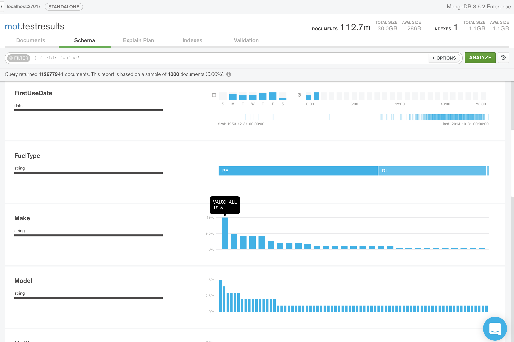

# Analysing UK MOT Vehicle Test Result Data Using MongoDB

An example project demonstrating the use of Python and MongoDB's Aggregation Framework to perform analysis of the UK 'MOT' UK annual vehicle test result data. An MOT is a [UK annual check on a vehicle](https://en.wikipedia.org/wiki/MOT_test), and is mandatory for all cars over 3 years old. The UK government makes the [data available to download](https://data.gov.uk/dataset/anonymised_mot_test), in anonymised form, for anyone to consume, through its data.gov.uk platform. Currently the MOT data set spans test results for the years 2005 to 2016.

When the MOT data is loaded from the gzipped CSV files into MongoDB, the total data set is approximately 400 million records, which has a data size of about 100GB in a MongoDB database. The approximate storage consumed is 30GB, when using the default WiredTiger storage engine, with its default 'snappy' compression. 

The following Python script can be used to load the CSV files into a MongoDB collection (see script's header comments for instructions on how to use):
* mdb-mot-import-csv

The following Python scripts provide examples of performing analysis on the MongoDB data set, using the Aggregation Framework (see header comments in each script for instructions on how to run; also see base of each script for an example of the aggregation results)

* mdb-mot-agg-top-cars-summary.py
* mdb-mot-agg-top-cars-with-top-models.py
* mdb-mot-agg-cars-facets.py

